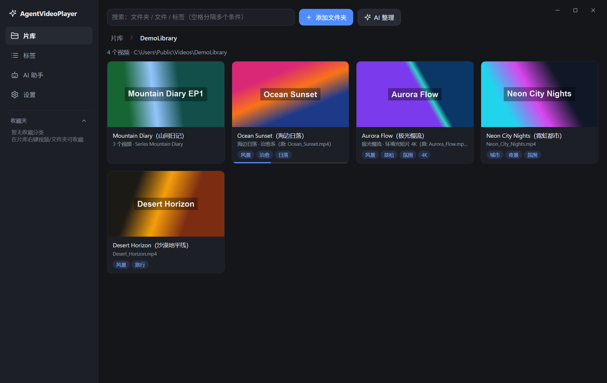
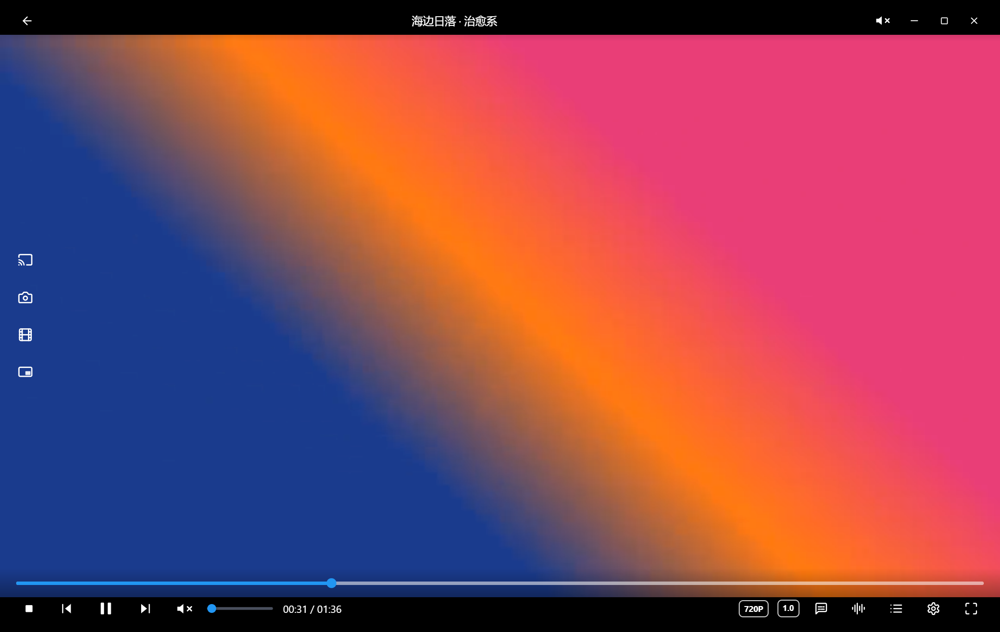
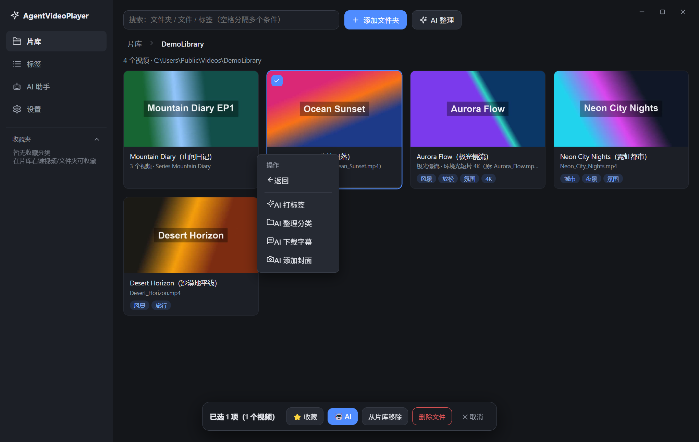
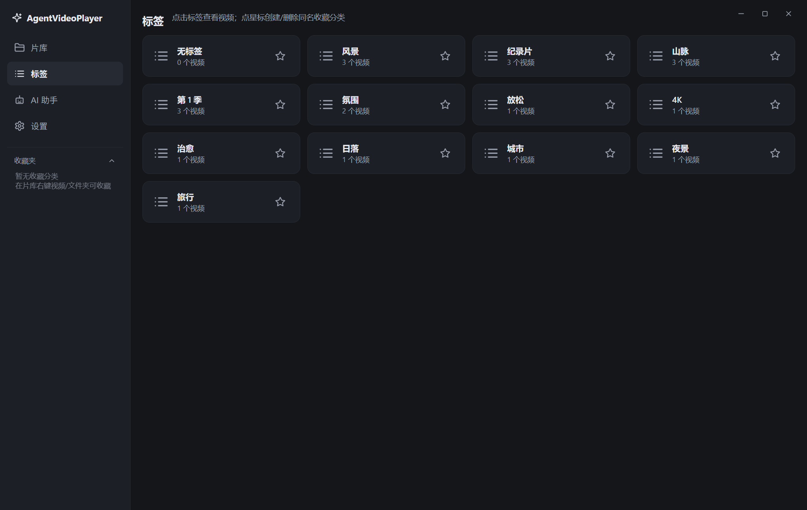

# AgentVideoPlayer

跨平台本地视频播放器，带 AI Agent 整理与片库功能。基于 Electron 构建，运行时零第三方依赖。

## 界面预览

| 片库（封面 / 标签 / 观看进度 / 剧集聚合） | 沉浸式播放器 |
| --- | --- |
|  |  |
| **右键 → AI 功能（打标签 / 整理 / 字幕 / 封面）** | **标签页** |
|  |  |

## 功能特性

- **本地视频播放** — 内置播放器，支持常见视频格式，无边框窗口界面
- **多音轨支持** — 自动探测视频内的每条音轨（语言/编码/声道），播放器「音轨」菜单自由切换，选择按文件记忆；切换到 AAC 轨走直通混流（秒切、不转码），AC3/E-AC3/DTS 等内置解不了的音轨（表现为"有画面没声音"）才用内置 ffmpeg 实时转成 AAC，拖动进度自动从新位置转码
- **片库管理** — 自动扫描本地视频目录，按分类/标签/收藏组织片库
- **AI Agent 整理** — 通过 AI 自动识别视频元信息，生成标题、标签、封面，并支持重命名/分类等虚拟整理操作（只写本地数据库，不改真实文件路径）
- **任务队列** — AI 任务串行排队执行，逐项容错，失败不影响已完成项
- **DLNA 投屏** — 局域网内投放到 DLNA 设备播放
- **内置 HTTP 服务** — 局域网串流播放

## 环境要求

- [Node.js](https://nodejs.org/) 18+
- npm

## 快速开始

```bash
# 安装依赖（ffmpeg-static 会下载随包分发的 ffmpeg；postinstall 会把开发版
# electron.exe 的文件描述/图标改成 AgentVideoPlayer，让「打开方式」菜单正确显示应用名）
npm install

# 以开发模式启动
npm start

# 打包 Windows 安装包与便携版
# 产物 exe 输出到 dist-exe/ 目录（ffmpeg 随包分发，无需系统安装）
npm run dist
```

## 项目结构

```
├── main/            # Electron 主进程
│   ├── main.js      # 入口：窗口创建与 IPC
│   ├── agent.js     # AI Agent 任务调度
│   ├── ai.js        # AI 接口调用
│   ├── aiMedia.js   # 视频元信息识别
│   ├── avstream.js  # 音轨实时转码流（AC3/DTS → AAC，127.0.0.1 HTTP 分块输出）
│   ├── queue.js     # 串行任务队列
│   ├── scanner.js   # 本地视频目录扫描
│   ├── db.js        # 本地数据存储
│   ├── media.js     # ffmpeg 路径解析与媒体信息探测
│   ├── files.js     # 文件操作
│   ├── dlna.js      # DLNA 投屏
│   ├── server.js    # 局域网 HTTP 串流服务
│   └── preload.js   # 预加载脚本
├── renderer/        # 渲染进程（界面）
│   ├── index.html
│   ├── styles.css
│   └── js/          # 播放器、片库、Agent 面板等模块
└── scripts/
    ├── dist.js            # 打包脚本
    └── patch-dev-exe.js   # 开发版 electron.exe 元数据补丁（npm install 后自动执行）
```

## 说明

- AI 整理产生的重命名/分类/封面均为**虚拟操作**，只写入本地应用数据，不会修改磁盘上的真实文件。
- AI 功能需要在设置中配置自己的 API Key。

## 设为系统默认播放器（Windows）

1. 在应用「设置」页点击 **注册文件关联**（写入当前用户注册表 HKCU，无需管理员权限）。
2. 在资源管理器中右键任意视频文件 → **打开方式** → 选择 **AgentVideoPlayer**，并勾选 **始终**；
   也可以到 Windows 设置 → 应用 → **默认应用** 中按格式指定。

之后双击视频文件即可直接用本应用播放；文件不在片库中时会自动登记进片库（可记忆播放进度、打标签、AI 分析）。
应用运行中再次双击其他视频，会在同一窗口直接切换播放。

- 便携版、安装版、开发模式（`npm start`）都支持上述注册方式。
- 「打开方式」等界面的应用名取自 exe 内嵌的文件描述，Windows 还会按它回写缓存。开发模式的 electron.exe 已通过 `scripts/patch-dev-exe.js`（npm install 后自动执行）把文件描述/图标改成 AgentVideoPlayer，因此菜单稳定显示应用名；打包版 exe 自带正确名称与图标。
- 若使用 NSIS 安装包并希望安装时静默注册，可改用 `build.fileAssociations` 配置（注意 electron-builder 要求同时开启 `nsis.perMachine`，安装时需要管理员权限）。

## License

[MIT](./LICENSE)
